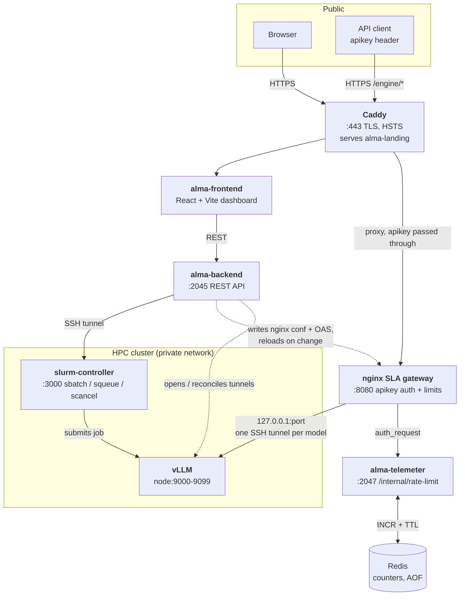

<h1 align="center">ALMA</h1>

<p align="center">
  <strong>Run large language models on an HPC cluster, and serve them under an SLA.</strong>
</p>

<p align="center">
  <a href="https://alma.us.es">alma.us.es</a>
</p>

---

ALMA turns a SLURM cluster into a managed LLM service. Administrators register a model and launch it as a
cluster job; ALMA places it on a node with free GPUs, opens an SSH tunnel to it, and publishes it on an
OpenAI-compatible gateway. Consumers get an API key governed by a Service Level Agreement — the gateway
enforces the rate limit written in that SLA and answers every request with live `X-RateLimit-*` headers.

Nothing about the cluster is exposed: the public surface is HTTPS at `alma.us.es`, with the API under
`/engine/*`.

## How a request travels



The control plane (solid, left) launches and supervises models. The data plane (solid, right) serves
inference. The dotted edges are what connects them: the backend generates the gateway configuration and
keeps one SSH tunnel alive per running model, so publishing a model and routing to it are the same act.

## Repositories

| Repository | What it does | Stack |
| --- | --- | --- |
| [**alma-frontend**](https://github.com/alma-org/alma-frontend) | Admin and user dashboard: cluster metrics, model and SLA management, users, chat portal. RBAC for Admin, Researcher, Student and Viewer | React 18, Vite, Tailwind, Radix / shadcn / MUI, Recharts, Vitest + Playwright |
| [**alma-backend**](https://github.com/alma-org/alma-backend) | REST API on `:2045`. Model lifecycle, SLA generation, nginx configuration, SSH tunnel reconciliation, model auto-restart, operator alerts, multi-device sessions | Node, Express, NeDB, Docker, Vitest + Newman |
| [**slurm-controller**](https://github.com/alma-org/slurm-controller) | Thin HTTP API on `:3000` over `sbatch`, `squeue`, `scancel` plus job logs. Runs *as a SLURM job* on the cluster; `alma-backend` is its only consumer | Node, Express, mustache job templates |
| [**alma-telemeter**](https://github.com/alma-org/alma-telemeter) | Rate-limit accounting behind nginx `auth_request` on `:2047`. Atomic per-key, per-endpoint counters in Redis, dynamic `X-RateLimit-*` headers, OAS telemetry UI | Express 5, ioredis, chokidar, winston, Jest |
| [**intelligent-proxy-manager**](https://github.com/alma-org/intelligent-proxy-manager) | Controller for SLA creation and updates in ALMA CORE: the Caddy + nginx configuration pipeline and its integration tests | Node, Caddy, nginx, Vitest |
| [**alma-landing**](https://github.com/alma-org/alma-landing) | Public landing page, served as static files by Caddy | Static |
| [**.github**](https://github.com/alma-org/.github) | This profile and organization-wide defaults | — |

## Deploy order

**`slurm-controller` first, then `alma-backend`.**

The controller has no CI/CD — it is resubmitted to the cluster by hand — while the backend deploys
automatically on a tag. So a backend release lands against whatever controller is already running, and if
that one is stale the backend degrades rather than fails: duplicate-launch protection falls back to the
local job record, the auto-restart loop stops launching, and the frontend shows an amber
*SLURM — degraded* indicator.

```bash
curl -s 'localhost:2045/api/health/slurm?refresh=1' | jq .capabilities
```

`status` is one of `OK`, `DEGRADED` (stale controller), `MISROUTED` (the base URL points at some other
service) or `UNREACHABLE`. `capabilities.controllerCommit` should match `git rev-parse --short HEAD` in the
cluster checkout. The distinction between *stale* and *misrouted* matters: both 404 the same endpoint, and
only the controller's `X-Request-ID` header tells them apart.

## Ports

| Port | Service |
| --- | --- |
| `443` | Caddy — TLS termination, landing page, `/engine/*` → gateway |
| `8080` | nginx SLA gateway — apikey auth, rate limits, JSON error bodies |
| `2045` | alma-backend REST API |
| `2047` | alma-telemeter, internal rate-limit endpoint |
| `3000` | slurm-controller, on the cluster, reached through an SSH tunnel |
| `9000`-`9099` | vLLM remote ports, one per model, on the GPU nodes |

## The SLA gateway

The gateway configuration is not written by hand. It is generated from an OpenAPI description plus SLA4OAI
agreements by [`sla-wizard`](https://www.npmjs.com/package/sla-wizard) and a chain of plugins:

```text
json-errors → auth-request-ratelimit → custom-baseurl → nginx-strip → nginx-confd → sla-wizard core
```

Each SLA becomes rate limits, per-client routing and an API key in the emitted nginx configuration, which
`alma-backend` writes and reloads whenever a model or an agreement changes.

| Package | What it adds |
| --- | --- |
| [`sla-wizard`](https://www.npmjs.com/package/sla-wizard) | Automated configuration of API rates and limits (OpenAPI + SLA4OAI) for Envoy, HAProxy, NGINX and Traefik |
| [`sla-wizard-nginx-confd`](https://www.npmjs.com/package/sla-wizard-nginx-confd) | Generates Nginx-Confd configuration files |
| [`sla-wizard-plugin-auth-request-ratelimit`](https://www.npmjs.com/package/sla-wizard-plugin-auth-request-ratelimit) | Replaces nginx `limit_req` with `auth_request`-based rate limiting, enabling dynamic `X-RateLimit` headers via alma-telemeter |
| [`sla-wizard-plugin-custom-baseurl`](https://www.npmjs.com/package/sla-wizard-plugin-custom-baseurl) | Overrides the nginx `proxy_pass` target per endpoint using the `x-nginx-server-baseurl` OAS extension |
| [`sla-wizard-plugin-json-errors`](https://www.npmjs.com/package/sla-wizard-plugin-json-errors) | Converts nginx HTML error responses (401, 403, 404, 500, 502, 503, 504) to JSON |
| [`sla-wizard-plugin-nginx-strip`](https://www.npmjs.com/package/sla-wizard-plugin-nginx-strip) | Strips URL prefixes (`x-nginx-strip`) before proxying |
| [`sla-wizard-plugin-sla-generator`](https://www.npmjs.com/package/sla-wizard-plugin-sla-generator) | Generates SLAs from a CSV file |

These are published on npm and are not repositories of this organization.

Rate limiting stays correct when alma-telemeter is down: nginx keeps its own `limit_req` as a fallback and
serves static `X-RateLimit-*` values, so a client is throttled and informed either way.

## Getting started

```bash
git clone https://github.com/alma-org/alma-backend.git
cd alma-backend
cp .env.example .env          # then edit it
docker compose up -d --build
```

The frontend is the same three steps in
[alma-org/alma-frontend](https://github.com/alma-org/alma-frontend), and `slurm-controller` is submitted to
the cluster with `./submit_api.sh` rather than run locally.

Each repository's README carries the real procedure — deployment order, environment variables, the SSH
tunnel model and the operational failure modes are documented there, particularly in
[alma-backend](https://github.com/alma-org/alma-backend#readme) and
[slurm-controller](https://github.com/alma-org/slurm-controller#readme).
